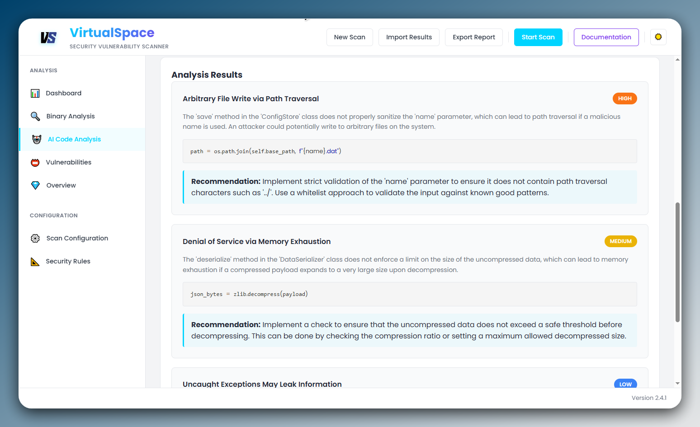

# VirtualSpace AppSec 🛡️

---

## 📌 Overview

VirtualSpace AppSec combines static code analysis with specialized machine learning trained on thousands of real-world vulnerability patterns. This PoC illustrates how our tailored AI outperforms generic models (like GPT-4) in identifying critical vulnerabilities in C, C++, and .NET applications, ensuring your code remains secure against emerging threats in the real world.

## 💎 Features

- **AI-Powered Detection**: Specialized machine learning trained explicitly for security vulnerability identification.
- **Supreme Accuracy**: Outperforms generic AI models by detecting complex vulnerabilities missed by others.
- **Advanced Static Analysis**: Comprehensive static binary and source-level examination.

## 🔍 Proof of AI Advantage

Included in this repository is a Python example demonstrating a critical vulnerability that GPT-4 ([GPT Test](https://chatgpt.com/c/688decd4-02e0-832c-812d-1bcb8c7df120)) failed to identify; instead, it pointed out code quality improvements, unrelated to vulnerabilities, while VirtualSpace AppSec successfully filtered and detected it, as shown in the screenshot above.

- **Python Proof Of Concept**: Illustrates a specific security flaw undetected by GPT-4.
- **Screenshot Proof**: Demonstrates detection by VirtualSpace AppSec's specialized AI.

## 🧪 Usage

Feel free to replicate and verify this demonstration to see the supreme detection capabilities of VirtualSpace AppSec if you have a license key to VirtualSpace AppSec, or purchase one with 10% OFF `GHOFF10` :)

## ⚠️ Disclaimer

This PoC is for demonstration and educational purposes only, designed to highlight the unique capability of VirtualSpace AppSec in identifying vulnerabilities missed by generic AI models. For real-world deployments, VirtualSpace AppSec provides comprehensive scanning and reporting features with enterprise-grade accuracy.

## 📜 License

This project is licensed under the MIT License. See the [LICENSE](LICENSE) file for details.
